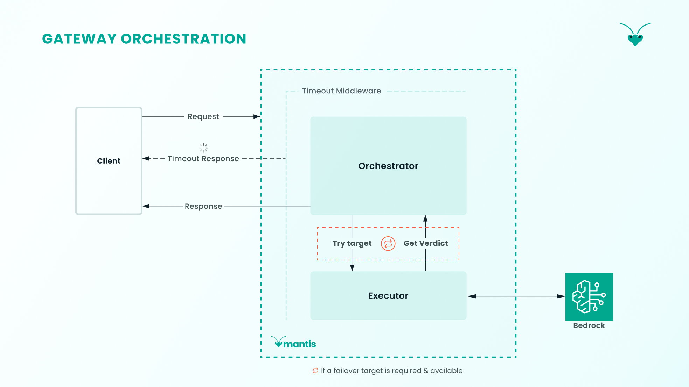
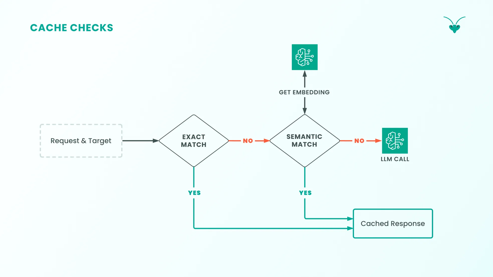
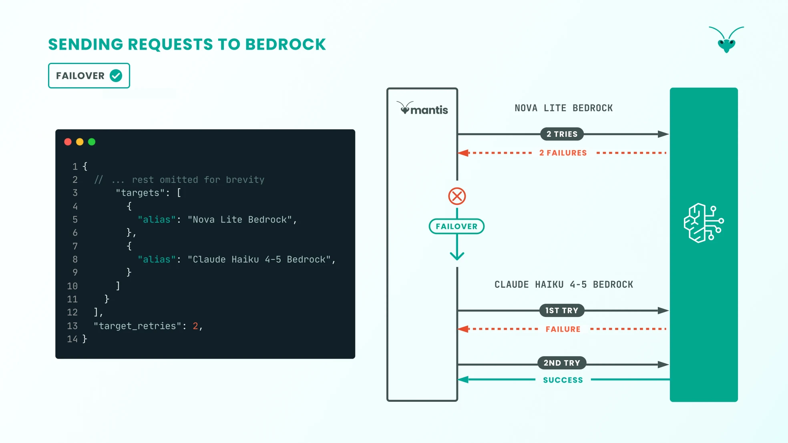
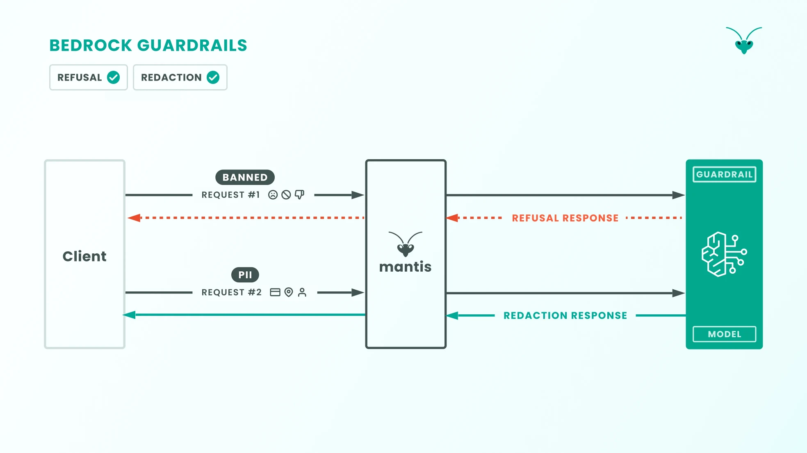
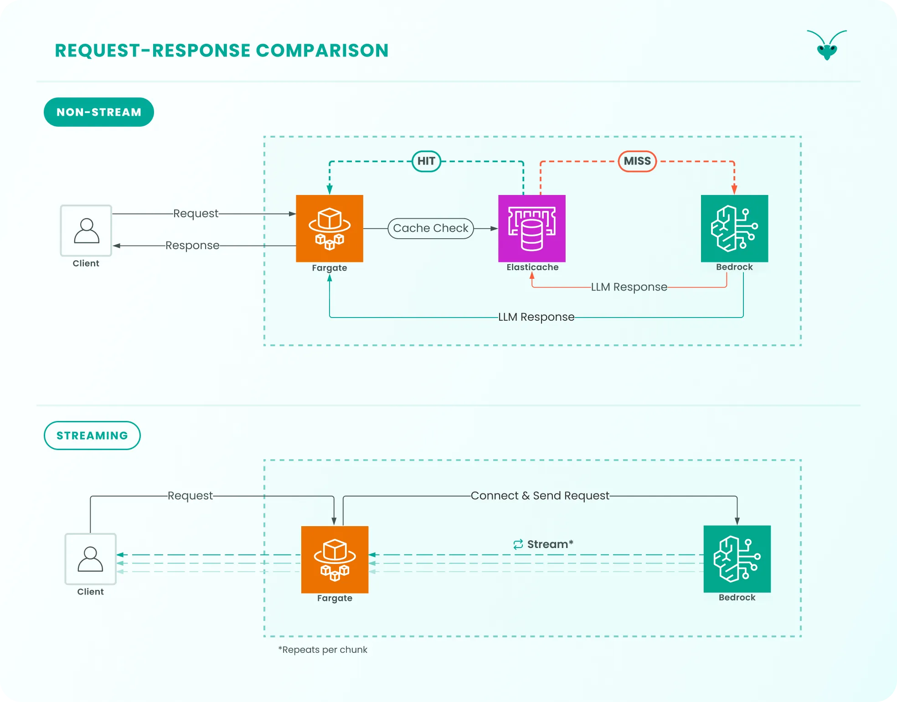
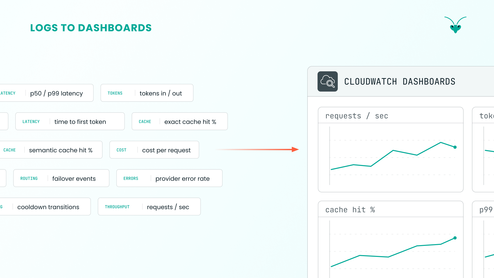
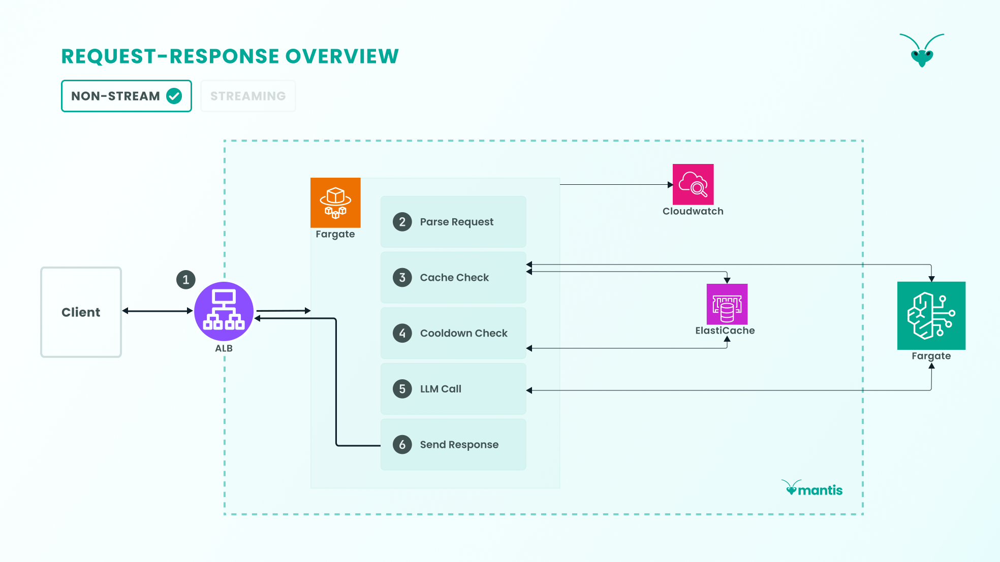

## A. Request-Response

A non-streaming request sent by a user to the gateway goes through several stages.

### 1. Ingress

Any request first goes through an Application Load Balancer (ALB), the public ingress into the gateway, which allows us to keep the rest of the system secured behind a private subnet.

Since we use Fargate tasks to run the gateway server and these containers and their private IP addresses are ephemeral, an ALB allows us to expose a permanent URL to users. It also allows us to keep the Fargate tasks private, perform health checks on the container, restrict access by CIDR block, and handle rolling task deployments behind a stable endpoint. HTTPS traffic is also handled by the ALB, as TLS is terminated there.

The request is then forwarded from the ALB to the Fargate task, which is where the gateway server runs.

### 2. Gateway Processing

First, the request is parsed: its headers and body are read and converted into an object the gateway can work with. This object is then sent to the *Orchestrator* module, which coordinates all subsequent steps that the request will go through.

#### Gateway Orchestration

The *Orchestrator* then:

1. Requests an ordered list of LLM endpoint targets from the routing module, given the request headers.

2. For each target, it runs:
    - exact and semantic cache checks: if the exact same request was already sent and answered, we serve the cached answer; otherwise, we check for a semantically equivalent answer
    - a cooldown check: if an endpoint is rate-limiting the gateway, the gateway waits before sending another request to it
    - an attempt to send the prompt to an LLM and receive an answer, handled by the engine module
    - guardrail checks against both the user prompt and the LLM response

3. Depending on the verdict, the *Orchestrator* decides whether to stop there, fail over to the next endpoint, or surface an error to the user.



#### Gateway Routing

One of the critical responsibilities of an LLM gateway is to route requests to various LLMs according to configuration.

The routing layer needs to enable the client to connect seamlessly with a collection of LLMs, as per Mantis’s configuration.

**Configuration Object:** Routing rules are defined in JSON and stored in AWS Parameter Store. The configuration file is loaded upon deployment. Teams can update the configuration file through the UI.

**Fallback Mechanisms:** Since LLM services experience more downtime than typical services, Mantis has fallback mechanisms with retries and fallback chains. For each request, the model target array for a routing rule serves as a fallback chain. The routing system moves across the fallback chain if requests exhaust the configurable retry count `target_retries` for a model or for error codes that trigger failovers.

```json
// Defines per-target retry count
"target_retries": 2
```

For streamed responses, failovers aren’t implemented if something goes wrong mid-stream. Instead, error chunks are sent to the client, and the connection is then closed.

**Cooldown:** If a model returns a rate limit error code, the model is immediately placed into a cooldown period as defined in the Mantis configuration.

```json
// Defines cooldown period in seconds
"cooldown_ttl": 60
```

The routing system removes the model from a target selection rotation for the duration of the cooldown period.

**Load Balancing**: Mantis load balances requests for a specific rule across a group of LLM models. The configuration JSON snippet below demonstrates client requests that the client categorises as “Code generation”, load-balanced across two LLM models by their alias names.

```json
"targets": [
        { "alias": "Claude Sonnet 4-5 Bedrock", "weight": 6 },
        { "alias": "Nova Pro Bedrock", "weight": 4 }
]
```

They are load-balanced by weight. According to this config, 60% of requests should be routed to the *Claude Sonnet 4-5 Bedrock* model, and the rest to the *Nova Pro Bedrock* model.

Routing happens as a result of the ordered list of targets built by the routing module. This is based on the user-populated routing configuration, which is composed of:

**1. Model aliases that refer to models in the gateway.**

```json
"aliases": {
  "Claude Sonnet 4-5 Bedrock": {
    "provider": "bedrock",
    "model": "us.anthropic.claude-sonnet-4-5-20250929-v1:0"
  },    
  "Nova Premier Bedrock": {
    "provider": "bedrock",
    "model": "us.amazon.nova-premier-v1:0"
  },
  "Nova Lite Bedrock": {
    "provider": "bedrock",
    "model": "us.amazon.nova-lite-v1:0"
  }
}
```

**2. A default model.**

```json
"default_model": "Claude Sonnet 4-5 Bedrock"
```

**3. Routing rules:** the core of a rule is a key-value pair that the routing engine will check against the incoming request headers. It then specifies a list of models to use in the event of a match.

```json
"routing_rules": [
    {
      "id": "1",
      "name": "Code generation",
      "match": { "name": "task-type", "value": "code_generation" },
      "targets": [
        { "alias": "Claude Sonnet 4-5 Bedrock", "weight": 6 },
        { "alias": "Nova Pro Bedrock", "weight": 4 }
      ]
    },
    // ...additional rules
]
```

**4. Settings for cache**, including Time To Live (TTL), and dials for LLM output temperature and semantic similarity search.

```json
prompt_cache": {
    "ttl_seconds": 3600,
    "temperature_threshold": 0.3,
    "semantic": {
      "similarity_threshold": 0.8,
      "top_k": 3,
      "conversation_size_threshold": 3
    }
  }
```

**5. Number of retries per model as well as streaming- and gateway-timeouts.**

```json
"target_retries": 2,
"initial_response_timeout": 30,
"stream_idle_timeout": 5,
```

Given the configuration example above in #3 , a request with header `task-type` set to `code_generation` triggers a match with rule `1`. The routing module then samples a model from the distribution implied by the `weight`s of all models in this rule. This forms a “target” that is appended to the ordered list the *Orchestrator* requested.

The first matched rule will append the sampled target followed by the remaining targets to the ordered list. This ensures the sampled target is attempted first. Next, the fallback model is appended to the list, and the list containing the model endpoints is returned to the *Orchestrator*, which then attempts a cache check and LLM call execution loop for each target in the ordered list.

### 3. Cache Checks

To reduce latency and the cost of redundant LLM calls, we implement cache checks using *Amazon ElastiCache Valkey* to return LLM responses that match given prompts.

Valkey is an open-source fork of Redis, providing a key-value store with sub-millisecond storage and retrieval. Crucially, it enables semantic caching by providing vector indexing and filtered nearest-neighbour search via its `valkey-search` module.

#### Cache Hits

These only occur when an incoming request matches a cache entry based on a combination of the messages array (i.e., a conversation), a system prompt, and the model & provider combination. We do not store conversation histories in Mantis, so we treat the contents of a request body as a full conversation.

This limits the use case for our cache to single-turn interactions in which a client provides all required context on each request.

Semantic cache hits occur when similar requests are sent to Mantis. The semantic cache is an opt-in feature, with Mantis choosing to have it off by default and leaving it up to developers to weigh up the tradeoffs. The reason for this is increased latency, a result of the semantic lookup mechanism, and the risk of cross-user contamination where cached LLM responses containing potentially sensitive data about one user are served to another.

A solution to that risk is user-based caching, but that significantly reduces the value of a semantic cache, which is to reduce overall LLM calls for similar requests. For example, a customer support bot that receives the same product questions like “what’s your refund policy?” benefits from semantic caching across users, since the answer doesn’t depend on who is asking.

Cross-contamination is not a concern for exact cache hits, as those are keyed on a hash of the full request (i.e., conversation, system prompt, model & provider). The only way for there to be cross-contamination is for one to send the exact same request, byte-for-byte, as a prior user, including the same personal information that would result in a sensitive LLM response.

#### Cache Tiers

While we refer in this case study to an exact-cache and a semantic-cache, they refer to the same database instance and are logically separated with key prefixes (`prompt:exact:` and `prompt:semantic:`). We collectively refer to these two as the response cache.

The response cache is bypassed under certain conditions, one of which is a configurable `temperature_threshold`. Requests with high temperatures lead to more non-deterministic LLM responses and should thus bypass the cache, whereas lower-temperature requests are considered sufficiently deterministic to be served the relevant cached response.

**Exact Cache.** The exact cache uses the request prompt as a cache key. Subsequent requests matching that key exactly are served a cached LLM response.

**Semantic Cache.** Unlike the exact cache, a semantic cache allows a new prompt to reuse the response from an earlier prompt with the same meaning, even if the wording differs. The semantic cache is only checked if the request conversation size is below a configurable `conversation_size` threshold as semantic similarity degrades as that grows. A similarity threshold is also configurable.

This functionality requires several steps:

1. **Create embedding:** The prompt is first sent to the Bedrock Titan v2 Embedding model to create a vector embedding. This is a long array of floating-point numbers representing a word’s position in vector space. Given two vector embeddings generated for, say, “mantis” and “insect”, one can determine how semantically similar they are based on their distance in vector space.

2. **Filter on model and provider:** Once the vector embedding for our prompt is generated, `valkey-search` first pre-filters for entries that match a request’s model and provider.

3. **Search by cosine similarity:** It then uses the Hierarchically Navigable Small World - Approximate Nearest Neighbour (HNSW-ANN) algorithm to search over that filtered subset in sub-linear time. The search finds the vector embeddings most similar to our prompt’s embedding using cosine similarity.

4. **Return top hit above threshold:** Of the top results found (`top_k`), we take the most similar one, check if it passes a configurable similarity threshold, and then serve its LLM response value to the user. Otherwise, it’s treated as a semantic-cache miss.

#### Response Cache Check Flow

Given its list of targets, a request prompt is checked against the response cache, starting with the first target:



1. **Exact hit -> return cached response:** If the request prompt is found to match a prior prompt in the exact cache, then the cached LLM response is served to the user.

2. **Exact miss -> semantic hit -> return cached response:** With no exact match, the optional semantic cache is checked if developers have opted to enable it.

### 4. Cooldown Check

If a request can't be served from the cache and needs to be sent to an LLM, we first check whether the target model is healthy. This is confirmed by the absence of the target in the cooldown key-value store. One of two outcomes is possible:

1. **Cooldown hit -> try a different target:** If a target is busy cooling down from recent failures, we move on to the next target in the chain.

2. **Cooldown miss -> continue to LLM call:** If a target is not in cooldown (i.e. healthy), the request proceeds to an LLM call for the current target

### 5. Request Is Made to LLM Model and Provider



AWS Bedrock is an AWS service that exposes a large collection of LLM models, along with ancillary services that complement LLM use (such as guardrails).

Once the prompt has passed the gateway's cache layer, the *Orchestrator* layer coordinates execution to obtain an LLM response from AWS Bedrock and then sends it back to the client. Mantis sends a request to the model, retrying failures up to the configured `target_retries` setting. If the request fails, Mantis then fails over to trying the next model specified in the routing configuration.

Once an LLM response is received, Mantis writes it to the response cache (both exact and semantic).

#### Guardrails with Bedrock



When Mantis sends an LLM request to AWS Bedrock, Bedrock’s Guardrails kick in. If the LLM request or response contains sensitive Personally Identifiable Information (PII), that information is “masked” in the request/response. This applies to the following PII types:

- phone number

- email address

- credit/debit card number

- US Social Security number

- UK unique taxpayer reference number

In addition, if LLM requests or responses can be categorised as the following, Mantis will return Bedrock’s guardrail blocked message, i.e. `this request was blocked by content policy` to the client:

- hate

- insults

- sexual

- violence

- misconduct

- financial advice

### 6. Response Is Sent to the User

**Non-Stream Responses**

Mantis returns different responses to the user depending on how the LLM provider handles the request. Mantis's non-stream responses are in JSON format. It returns a 200 OK response if the LLM provider responded successfully or a 504 response if the request timed out, i.e. took longer than the `initial_response_timeout` time as set in the Mantis configuration. If AWS Bedrock fails to return a response, an error response is returned to the client.

If that error is a `429 ThrottlingException`, then the target’s model and provider are placed in cooldown with a user-configured TTL.

**Stream Responses**

If the LLM provider streams a response after Mantis receives a stream request, Mantis will send HTTP headers that indicate the request was successful (including the 200 OK code). Chunks are then streamed to the client

If a response fails mid-stream, Mantis simply streams an error response to the client and ends the stream.

#### Stream vs Non-Stream



Within the Mantis architecture, non-stream LLM responses make contact with every part of the architecture. This includes the cache. Whereas streamed responses do not make contact with the cache. There are no cache lookups before the request is sent to the LLM, and streamed responses are not cached as they pass through Mantis.

## B. Observability



AWS CloudWatch is used to capture the Mantis application's log output. CloudWatch is a logging and monitoring service and provides real-time insight into your application.

Because CloudWatch is tightly integrated with other AWS services and is easy to set up alongside AWS infrastructure, it is the natural choice for exposing Mantis’s observability output.

Mantis instruments every request with an ID, which is included with every emitted log. Insight into the entire request/response cycle is exposed as a result.

Metrics include:

- Per-request latency & token counts

- Total successful & failed requests

- P50, P90 and P99 latency across all streamed and non-streamed responses

- Cache errors

- Total cache hits & misses

Mantis exposes more metrics than are listed here. Aggregated metrics (e.g., total failed requests) can be calculated across both custom and predefined time periods.

## C. Request-Response Overview


